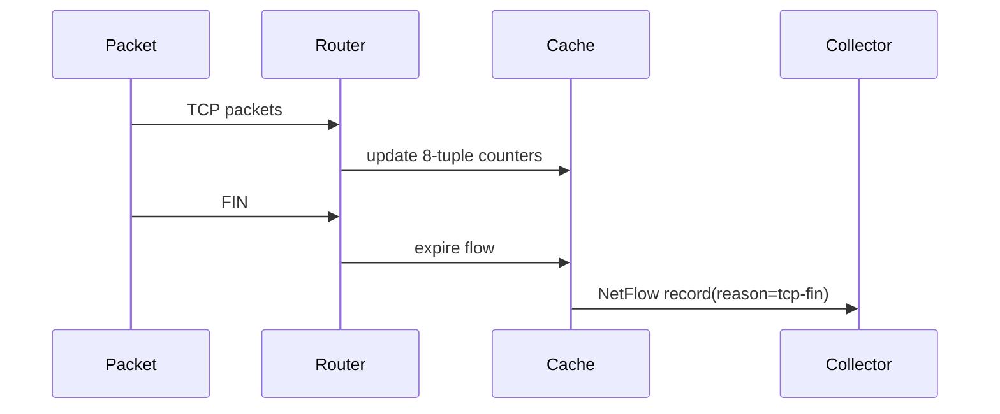
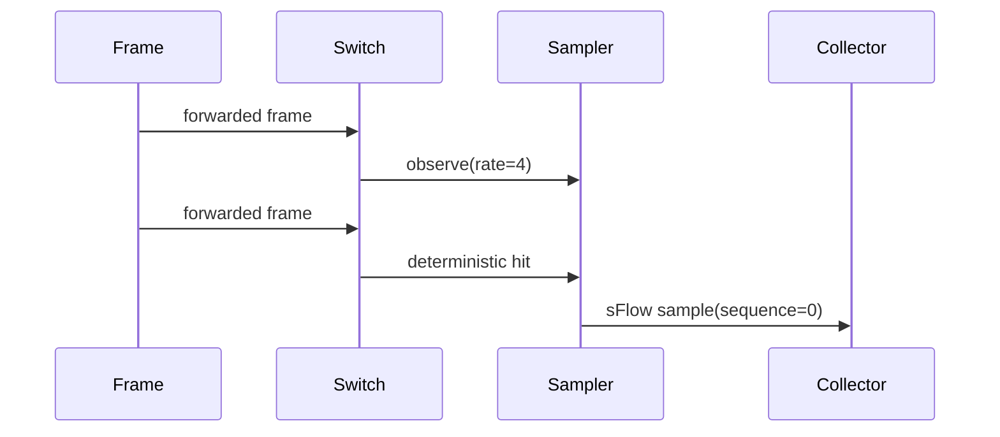

# Flow Observability: NetFlow v9 And sFlow v5

Netlab models flow observability with an in-process collector. Routers can emit
NetFlow-like flow records, switches can emit sFlow-like header samples, and the
UI reads both from the same `FlowCollector` buffer. No UDP export socket is
created.

## NetFlow v9 Record

The NetFlow teaching subset uses one fixed v9 template: version `9`, template id
`256`.

| Field            |  IE | Value                            |
| ---------------- | --: | -------------------------------- |
| `IPV4_SRC_ADDR`  |   8 | source IP                        |
| `IPV4_DST_ADDR`  |  12 | destination IP                   |
| `L4_SRC_PORT`    |   7 | TCP/UDP source port, or `0`      |
| `L4_DST_PORT`    |  11 | TCP/UDP destination port, or `0` |
| `PROTOCOL`       |   4 | `tcp`, `udp`, or `icmp`          |
| `TOS`            |   5 | `dscp << 2`                      |
| `INPUT_SNMP`     |  10 | ingress interface id             |
| `OUTPUT_SNMP`    |  14 | egress interface id              |
| `IN_PKTS`        |   2 | packet count                     |
| `IN_BYTES`       |   1 | byte count                       |
| `FIRST_SWITCHED` |  22 | first trace step                 |
| `LAST_SWITCHED`  |  21 | last trace step                  |
| `TCP_FLAGS`      |   6 | OR of TCP flags                  |

The flow key is source IP, destination IP, source port, destination port,
protocol, ingress interface, egress interface, and ToS. FIN/RST expires TCP
flows immediately; idle flows expire by `inactiveTimeoutMs`; long-lived flows
expire by `activeTimeoutMs`; a full cache exports the least-recently-used entry
with `cache-evict`.

## sFlow v5 Sample

The sFlow subset emits flow samples only (`sampleFormat = 1`). Each sample stores
the switch id, port id, sequence, sampling rate, sample pool, dropped count,
input/output ids, original frame length, and a copied header prefix.

Real sFlow uses Poisson sampling. Netlab intentionally uses deterministic `1:N`
sampling: packet number `N`, `2N`, `3N`, and so on are sampled. This keeps
sandbox replay and alpha/beta comparisons stable.

## FlowCollector

`FlowCollector` is a ring buffer. It stores the newest records, drops the oldest
on overflow, supports filtering by device, kind, and time, and notifies
subscribers on every accepted record.

## Trace Annotations

Observability-enabled devices add trace annotations without changing forwarding:

- `netflow:flow-update`
- `netflow:flow-export`
- `sflow:sampled`
- `sflow:dropped`

These annotations are renderable in PacketTimeline and filterable by the trace
filter.
