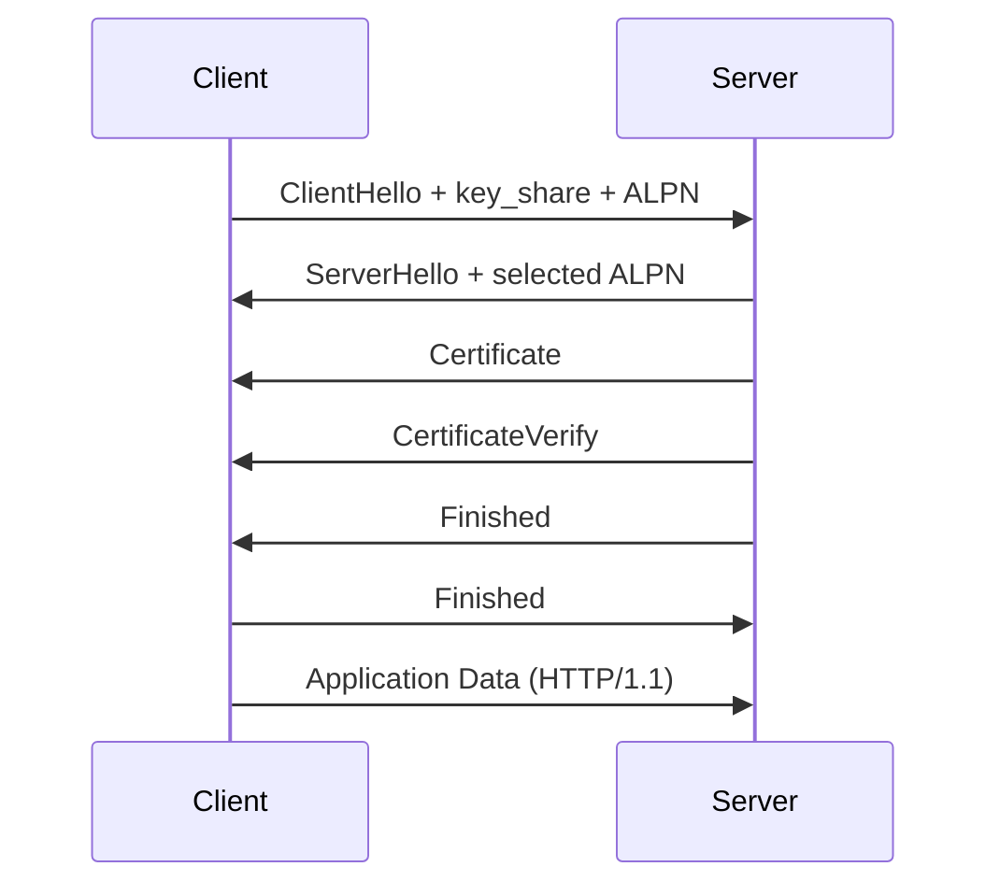

# TLS 1.3 Teaching Subset

Netlab models a deterministic TLS 1.3 handshake so learners can see what HTTPS adds before HTTP bytes move. The implementation is intentionally a teaching subset:

- TLS 1.3 only, with `TLS_AES_128_GCM_SHA256` and X25519-shaped key shares.
- Placeholder crypto through `CryptoProvider`, currently `FakeDeterministicProvider`.
- ALPN negotiation for `http/1.1`; later HTTP/2 and HTTP/3 plans reuse the same path.
- Trace annotations for `ClientHello`, `ServerHello`, `Certificate`, `CertificateVerify`, `Finished`, application data, and fatal alerts.

The placeholder provider preserves TLS structure but not cryptographic strength. It builds RFC-shaped labels, records, and transcript steps while using deterministic byte math so tests, demos, sandbox replay, and future wireless handshakes remain reproducible. Real WebCrypto-backed primitives are scoped to `plan/81k` and should replace the provider, not the call sites.

TLS is represented as an L5/session-layer teaching module in `src/layers/l5-tls/`, between TCP transport and HTTP application behavior. Plain HTTP remains unchanged unless a demo or caller explicitly runs the TLS orchestrator.

Out of scope: TLS 1.2 and older, mTLS, certificate-chain validation, session resumption, 0-RTT, multiple cipher suites, ECH, and real cryptographic correctness.
